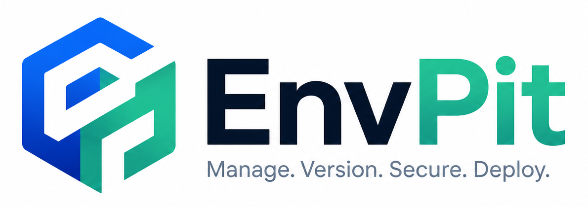

  <picture>
    <source media="(prefers-color-scheme: dark)" srcset=".github/assets/logo-dark.png">
    
  </picture>

<h1 align="center">EnvPit Community</h1>

Welcome to the community hub for **[EnvPit](https://envpit.com)** — a configuration &
secrets management platform for engineering teams.

> This repository is for **community discussion, feedback, feature requests, bug reports,
> and the public roadmap**. The EnvPit product code lives in a separate private repository.

## 💬 Discussions

Head to the **[Discussions](https://github.com/ShoDeBiz/envpit-community/discussions)** tab:

| Category | Use it for |
|---|---|
| **Q&A** | Questions about using EnvPit, SDKs, or the API |
| **Ideas** | Feature requests (upvote the ones you want!) |
| **Show & Tell** | Share how you use EnvPit |
| **Announcements** | Product updates & release notes (read-only) |

## 🐛 Reporting a problem

- **In-app:** use the **"Send feedback / report a bug"** button inside EnvPit — it attaches
  context automatically. ⚠️ **Never paste secrets or credentials** into a report.
- **Here:** open a [Discussion under Q&A](https://github.com/ShoDeBiz/envpit-community/discussions)
  (or an Issue once bug templates are set up).
- **Security issues:** please do **not** file publicly — email **security@envpit.com** (see
  our security policy). Responsible disclosure is appreciated.

## 🔐 A note on secrets

EnvPit stores credentials. **Never share real secrets, API keys, `.env` contents, or tokens**
in Discussions, Issues, or screenshots. Redact before posting.

## 🔗 Links

- Website: https://envpit.com
- Docs: https://envpit.com/docs
- Status: https://status.envpit.com
- Contact: support@envpit.com

## 📜 Conduct

Be kind and constructive. Participation is governed by our
[Code of Conduct](./CODE_OF_CONDUCT.md).
